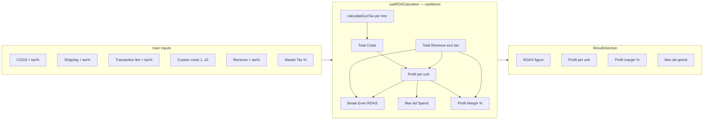
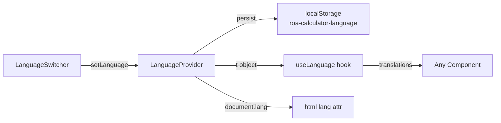
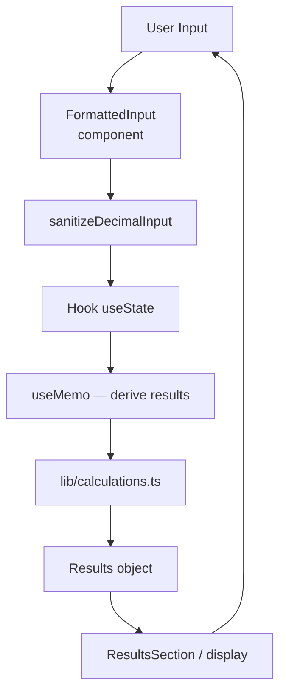

# ROA Calculator — Product Requirements Document

## 1. Product Overview

A **browser-only** e-commerce calculator that helps sellers determine their **Break-Even ROAS** (Return on Ad Spend) and understand their unit economics. No backend, no auth, no database — all state lives in memory with language preference persisted in `localStorage`.

**Target users:** E-commerce sellers (Shopify, Shopee, Lazada, etc.) running paid ads.

**Core value:** Answer *"How much ROAS do I need to at least break even on my ads?"* in seconds.

---

## 2. Architecture Overview

```mermaid
flowchart TD
    subgraph browser [Browser — Client Only]
        subgraph providers [Providers]
            LP[LanguageProvider\nlocalStorage persist]
            TP[TooltipProvider]
        end

        subgraph page [app/page.tsx — use client]
            LS[LanguageSwitcher]
            Tabs[Tabs: ROA | Basic]
        end

        subgraph roa [ROA Tab]
            C[Calculator]
            CS[CostSection]
            RS[RevenueSection]
            RES[ResultsSection]
            ED[EducationalContent]
        end

        subgraph basic [Basic Tab]
            BC[BasicCalculators]
            GP[GrossProfit]
            FC[FixedCost]
            VC[VariableCost]
            CPU[CostPerUnit]
            SP[SellingPrice]
            ST[SalesTarget]
        end

        subgraph hooks [Hooks — Business Logic]
            uROA[useROACalculator]
            uCC[useCalculatorCurrency]
            uFI[useFormattedInput]
            uGP[useGrossProfitCalculator]
            uFC[useFixedCostCalculator]
            uVC[useVariableCostCalculator]
            uCPU[useCostPerUnitCalculator]
            uSP[useSellingPriceCalculator]
            uST[useSalesTargetCalculator]
        end

        subgraph lib [lib — Pure Functions]
            CALC[calculations.ts]
            FMT[formatting.ts]
            CUR[currencies.ts]
            I18N[i18n/context + translations]
        end
    end

    LP --> page
    TP --> page
    page --> roa
    page --> basic

    C --> uROA
    CS & RS & RES --> C
    BC --> GP & FC & VC & CPU & SP & ST

    uROA --> CALC
    uCC --> CUR
    uGP & uFC & uVC & uCPU & uSP & uST --> CALC
    uFI --> FMT

    LP --> I18N
    LS --> LP
```

---

## 3. Tech Stack

- **Framework:** Next.js 16 (App Router), React 19
- **Language:** TypeScript (strict)
- **Styling:** Tailwind CSS v4 + shadcn/ui + Radix UI
- **Icons:** Lucide React
- **Fonts:** Geist Sans + Geist Mono
- **i18n:** Custom `LanguageProvider` (EN / MS), `localStorage`
- **No backend, no DB, no auth**

---

## 4. Application Structure

```
app/
├── layout.tsx              # Root layout, fonts, providers
├── page.tsx                # Tab shell (ROA | Basic)
├── globals.css             # Tailwind v4 tokens, dark mode
└── components/
    ├── calculator/         # Main ROAS flow
    │   ├── index.tsx       # Orchestrator, calls useROACalculator
    │   ├── cost-section.tsx
    │   ├── revenue-section.tsx
    │   └── results-section.tsx
    ├── basic-calculators/  # 6 standalone calculators
    └── educational-content.tsx, footer.tsx

components/ui/              # shadcn primitives + custom inputs
hooks/                      # One hook per calculator + shared hooks
lib/
├── calculations.ts         # Core math (ROAS, tax, margins)
├── formatting.ts           # Input sanitization, comma formatting
├── currencies.ts           # Static currency list
├── utils.ts                # cn() helper
└── i18n/                   # Provider, types, en.json, ms.json
types/index.ts              # Shared TypeScript interfaces
```

---

## 5. Feature Modules

### 5.1 ROA Tab — Break-Even ROAS Calculator

**Purpose:** Given costs and revenue per unit, calculate what ROAS is needed to break even.

**Data flow:**



**Key formulas:**

- `exclTax = value / (1 + tax/100)`
- `profitPerUnit = totalRevenue − totalCosts`
- `breakEvenROAS = totalRevenue / (totalRevenue − totalCosts)` → 0 if profit ≤ 0
- `profitMargin = (profitPerUnit / totalRevenue) × 100`
- `maxAdSpend = profitPerUnit`

**Constraints:**

- Max 10 custom cost lines
- New custom lines inherit current master tax %
- Reset wipes all fields and resets currency to language default

---

### 5.2 Basic Tab — 6 Unit-Economics Calculators

Each calculator is independent — its own hook, local state, currency selector.

| # | Calculator        | Key Output                                           |
| --- | ----------------- | ---------------------------------------------------- |
| 1   | Gross Profit      | Gross profit, markup %, gross margin %               |
| 2   | Fixed Cost / Unit | Fixed cost per unit (total fixed ÷ units sold)     |
| 3   | Variable Costs    | Total variable cost per unit                         |
| 4   | Cost Per Unit     | Fixed/unit + variable/unit = total cost/unit       |
| 5   | Selling Price     | Min price, recommended price, net profit, net margin |
| 6   | Sales Target      | Units needed for revenue goal, estimated profit    |

- Each supports up to 20 extra cost lines (Fixed & Variable)
- All share `useCalculatorCurrency` for language-aware defaults

---

## 6. Shared Systems

### 6.1 Internationalisation (i18n)



- Two languages: **EN** and **MS (Malay)**
- Full translation trees in `lib/i18n/translations/en.json` and `ms.json`
- Language change does **not** reset calculator state

### 6.2 Currency

- Default: **MYR** for Malay, **USD** for English
- User can manually override — stored in a ref so language changes don't revert it
- Reset clears the override and returns to language default
- Formatting via `Intl.NumberFormat` with `en-US` locale

### 6.3 Input Handling

- `FormattedInput`: wraps raw `<input>` with comma formatting and cursor preservation
- `formatDecimalInput` / `sanitizeDecimalInput` in `lib/formatting.ts`
- All monetary fields strip non-numeric characters before parsing

### 6.4 Tab State Persistence

- Tabs use `forceMount` — switching tabs does **not** destroy in-memory state
- No persistence to `localStorage` for calculator values (by design)

---

## 7. Data Flow Summary



---

## 8. State Management

| State              | Where                            | Persisted      |
| ------------------ | -------------------------------- | -------------- |
| Language           | `LanguageProvider` context       | `localStorage` |
| Currency selection | `useCalculatorCurrency` ref      | No             |
| Calculator inputs  | Hook `useState` per calculator   | No             |
| Derived results    | `useMemo` in each hook           | No             |
| Custom cost rows   | `useState` in `useROACalculator` | No             |

No global store (no Zustand/Redux). State is intentionally local and ephemeral.

---

## 9. Known Gaps / Future Work

- `profitabilityStatus` is computed in `ResultsSection` but **never rendered** — status labels (losing / low margin / healthy) exist in i18n and logic but are invisible to users
- No persistence of calculator inputs across page reloads
- No sharing / export of results
- No test suite currently configured
- Dark mode CSS variables defined but toggle UI not present
- Commented-out tooltip UI in `CostSection` / `CostField`

---

## Related documents

- **[MVP-PRD.md](./MVP-PRD.md)** — Original MVP feature spec and UI details
- **[AGENTS.md](./AGENTS.md)** — Build commands and coding guidelines for contributors
